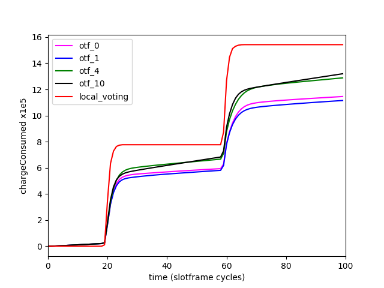
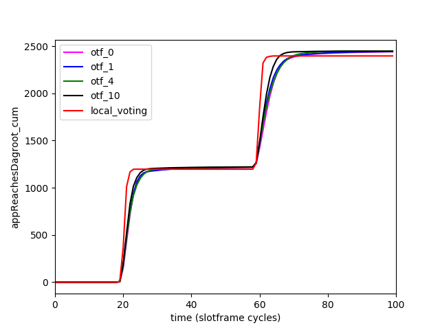
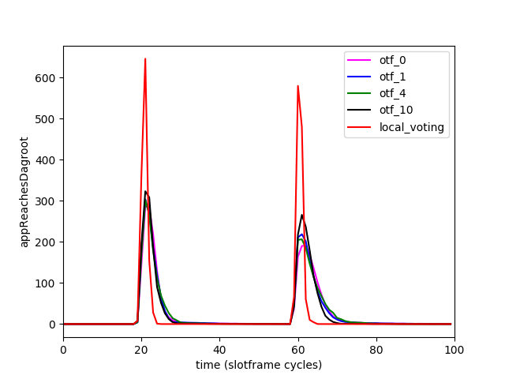
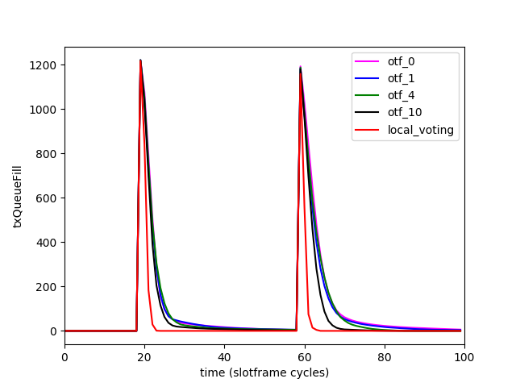
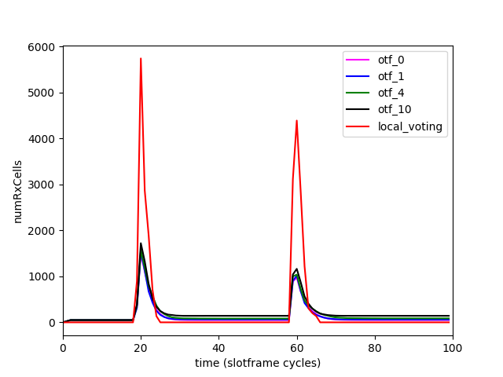
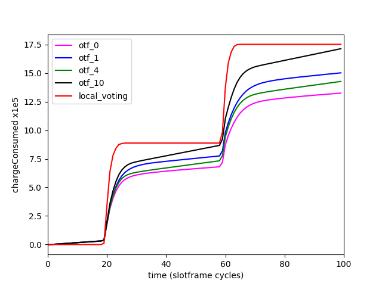
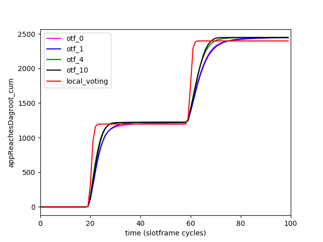
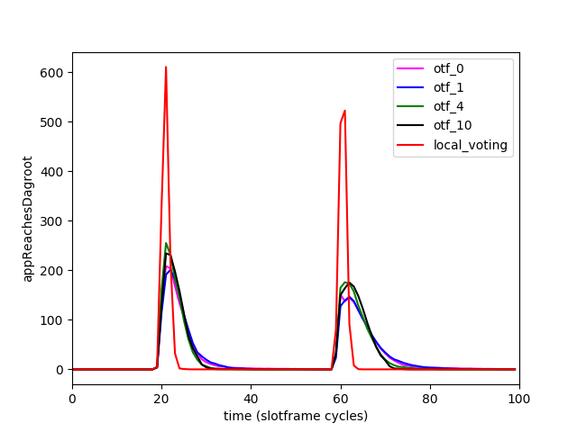
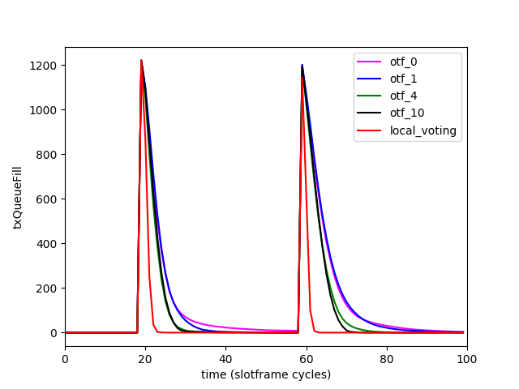
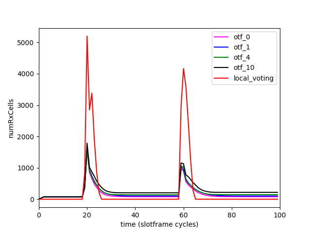

Local Voting TSCH
=================

Implementation of the Local Voting algorithm in the 6TiSCH Simulator, and some
simulation results. Comparison of Local Voting with OTF, thresholds 0,1,4,10,
1,2, and 3 parents, and 10 and 100 buffer size.

You can find eps and png figures of the results in folder bin/simData/

Some indicative results:

Aggregated Values vs parameters
===============================

1 packet(s) per node per burst
------------------------------
### chargeConsumed, 1 packets/node/burst

### reliability, 1 packets/node/burst

### time_all_root, 1 packets/node/burst

### max_latency, 1 packets/node/burst

### latency, 1 packets/node/burst

### max_queue_delay, 1 packets/node/burst

### queue_delay, 1 packets/node/burst

5 packet(s) per node per burst
------------------------------
### chargeConsumed, 5 packets/node/burst

### reliability, 5 packets/node/burst

### time_all_root, 5 packets/node/burst

### max_latency, 5 packets/node/burst

### latency, 5 packets/node/burst

### max_queue_delay, 5 packets/node/burst

### queue_delay, 5 packets/node/burst

25 packet(s) per node per burst
------------------------------
### chargeConsumed, 25 packets/node/burst

### reliability, 25 packets/node/burst

### time_all_root, 25 packets/node/burst

### max_latency, 25 packets/node/burst

### latency, 25 packets/node/burst

### max_queue_delay, 25 packets/node/burst

### queue_delay, 25 packets/node/burst

Some indicative scenarios
===================

Scenario buffer: 100, parents: 1, packets: 25
------------------------------
### chargeConsumed

### appReachesDagroot_cum

### appReachesDagroot

### txQueueFill

### numRxCells

Scenario buffer: 100, parents: 2, packets: 5
------------------------------
### chargeConsumed

### appReachesDagroot_cum

### appReachesDagroot

### txQueueFill

### numRxCells

Scenario buffer: 10, parents: 3, packets: 1
------------------------------
### chargeConsumed

### appReachesDagroot_cum

### appReachesDagroot

### txQueueFill

### numRxCells

The Remainder of this document is orginal README from the parent repository,
https://bitbucket.org/6tisch/simulator/src

The 6TiSCH Simulator
====================

Brought to you by:

* Thomas Watteyne (watteyne@eecs.berkeley.edu)
* Kazushi Muraoka (k-muraoka@eecs.berkeley.edu)
* Nicola Accettura (nicola.accettura@eecs.berkeley.edu)
* Xavier Vilajosana (xvilajosana@eecs.berkeley.edu)

Scope
-----

6TiSCH is an active IETF standardization working group which defines mechanisms to build and maintain communication schedules in tomorrow's Internet of (Important) Things. This simulator allows you to measure the performance of those different mechanisms under different conditions.

What is simulated:

* protocols
    * IEEE802.15.4e-2012 TSCH (http://standards.ieee.org/getieee802/download/802.15.4e-2012.pdf)
    * RPL (http://tools.ietf.org/html/rfc6550)
    * 6top (http://tools.ietf.org/html/draft-wang-6tisch-6top-sublayer)
    * On-The-Fly scheduling (http://tools.ietf.org/html/draft-dujovne-6tisch-on-the-fly)
* the "Pister-hack" propagation model with collisions
* the energy consumption model taken from
    * [A Realistic Energy Consumption Model for TSCH Networks](http://ieeexplore.ieee.org/xpl/login.jsp?tp=&arnumber=6627960&url=http%3A%2F%2Fieeexplore.ieee.org%2Fiel7%2F7361%2F4427201%2F06627960.pdf%3Farnumber%3D6627960). Xavier Vilajosana, Qin Wang, Fabien Chraim, Thomas Watteyne, Tengfei Chang, Kris Pister. IEEE Sensors, Vol. 14, No. 2, February 2014.

What is *not* simulated:

* downstream traffic

More about 6TiSCH:

| what             | where                                                               |
|------------------|---------------------------------------------------------------------|
| charter          | http://tools.ietf.org/wg/6tisch/charters                            |
| data tracker     | http://tools.ietf.org/wg/6tisch/                                    |
| mailing list     | http://www.ietf.org/mail-archive/web/6tisch/current/maillist.html   |
| source           | https://bitbucket.org/6tisch/                                       |

Gallery
-------

|  |  |  |
|--|--|--|
|  |  |  |

Installation
------------

* Install Python 2.7
* Clone or download this repository
* To plot the graphs, you need Matplotlib and scipy. On Windows, Anaconda (http://continuum.io/downloads) is a good on-stop-shop.

Running
-------

* Run a simulation: `bin/simpleSim/runSim.py`
* Plot fancy graphs: `bin/simpleSim/plotStuff.py`

Use `bin/simpleSim/runSim.py --help` for a list of simulation parameters. In particular, use `--gui` for a graphical interface.

Code Organization
-----------------

* `bin/`: the script for you to run
* `SimEngine/`: the simulator
    * `Mote.py`: Models a 6TiSCH mote running the different standards listed above.
    * `Propagation.py`: Wireless propagation model.
    * `SimEngine.py`: Event-driven simulation engine at the core of this simulator.
    * `SimSettings.py`: Data store for all simulation settings.
    * `SimStats.py`: Periodically collects statistics and writes those to a file.
    * `Topology.py`: creates a topology of the motes in the network.
* `SimGui/`: the graphical user interface to the simulator

Issues and bugs
---------------

* Report at https://bitbucket.org/6tsch/simulator/issues
